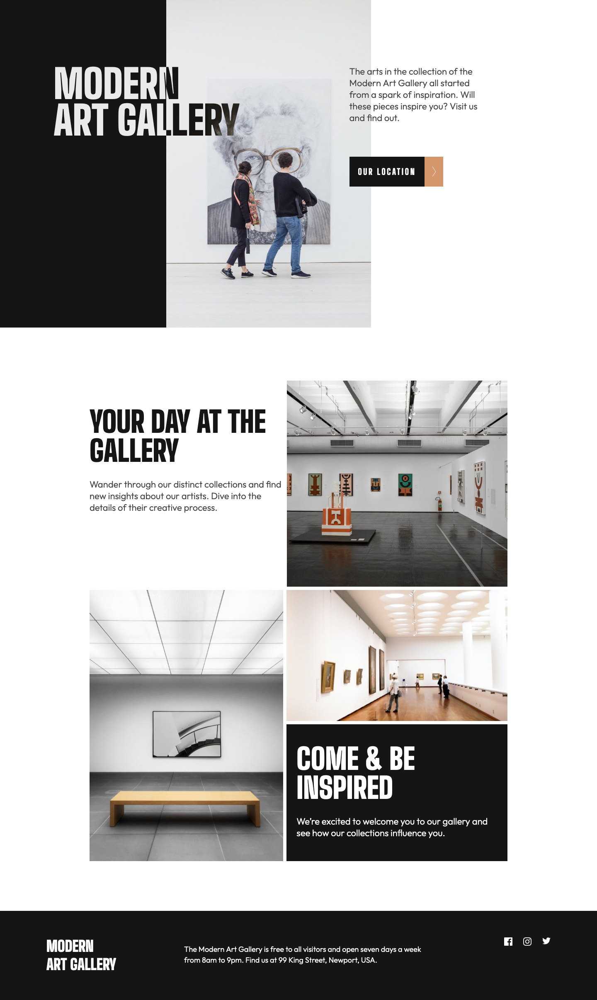

# Frontend Mentor - Art gallery website solution

This is a solution to the [Art gallery website challenge on Frontend Mentor](https://www.frontendmentor.io/challenges/art-gallery-website-yVdrZlxyA). Frontend Mentor challenges help you improve your coding skills by building realistic projects.

## Table of contents

- [Overview](#overview)
  - [The challenge](#the-challenge)
  - [Screenshot](#screenshot)
  - [Links](#links)
- [My process](#my-process)
  - [Built with](#built-with)
  - [What I learned](#what-i-learned)
  - [Continued development](#continued-development)
- [Author](#author)

## Overview

The following challenge was completed using HTML5, CSS3 and JavaScript. I also used this project to learn and explore animations using GSAP.

### The challenge

Users should be able to:

- View the optimal layout for each page depending on their device's screen size
- See hover states for all interactive elements throughout the site

### Screenshot




### Links

- Solution URL: [Add solution URL here](https://github.com/am1553/art-gallery)
- Live Site URL: [Add live site URL here](https://am1553.github.io/art-gallery/)

## My process

1. Analysed the design from which notes were taken to plan out the layout and styling.
2. Created Styles folder consisting of all the styles required using SCSS.
3. Used clamp() method to make the fonts responsive across devices.
4. Added all the HTML elements.
5. Styled all the elements to it's position for the mobile layout.
6. Made the layout responsive using mediaqueries.
7. Added JavaScript to navigate the pages using the button.
8. Added animations using JavaScript.

### Built with

- Semantic HTML5 markup
- SCSS
- Flexbox
- CSS Grid
- Mobile-first workflow
- Vanilla JavaScript

### What I learned

Use this section to recap over some of your major learnings while working through this project. Writing these out and providing code samples of areas you want to highlight is a great way to reinforce your own knowledge.

Made a great use of the clamp() property in SCSS to make the font-size responsive. Doing this in the beginning saved me a lot of time in regards to positioning and resizing again. An alternative to this that I used to use was mediaquery which would consume a lot of time.

Taking notes from the design prior to coding really helped my workflow and eased into next steps smoothly. This saved me time as I knew exactly what I have to do next.

I used GSAP for animations and tried ScrollTrigger. I am yet to learn more about it, but it makes it more fun and brings the page to life, which motivates me to learn more and get better at it.

```css
h1 {
  font-size: clamp(3.75rem, 7vw, 6rem);
  line-height: clamp(3.4375rem, 20vh, 5.5rem);
}
```

```js
gsap.from(".image-two, .image-three", {
  scrollTrigger: {
    trigger: ".image-two",
    start: "-100%",
    end: "bottom",
  },
  opacity: 0,
  duration: 1,
  ease: "back",
  stagger: 0.5,
});
```

### Continued development

I further want to improve on being efficient with code.
I want to start applying my learnings of React on the next project.

## Author

- Website - [Aryan Mehta](https://aryanm.com)
- Frontend Mentor - [@am1553](https://www.frontendmentor.io/profile/am1553)

**Note: Delete this note and add/remove/edit lines above based on what links you'd like to share.**
